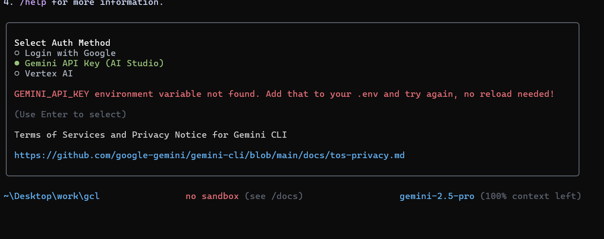
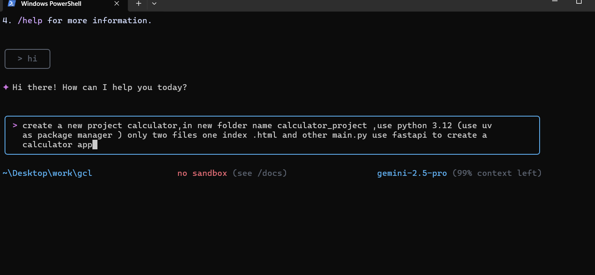
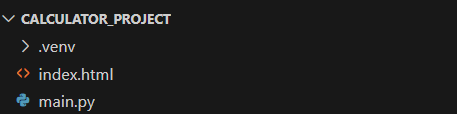
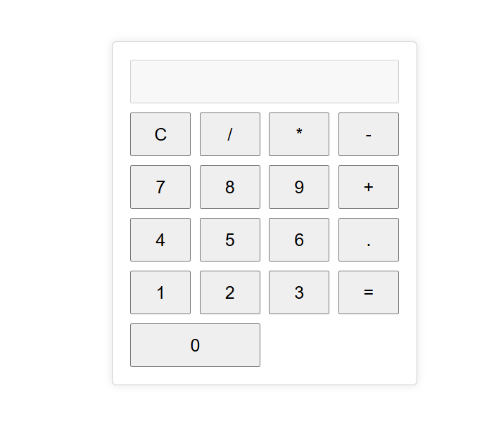

# Supercharge Your Workflow with Google Gemini CLI

Unlock AI-powered CLI in seconds with the new [Google Gemini CLI](https://github.com/google-gemini/gemini-cli).

---

## 🚀 Introduction

Gemini CLI lets you bootstrap projects, generate code, and integrate AI assistants directly from your terminal.

---

## 💻 Installation

Ensure you have **Node.js ≥ 18** installed, then:

```bash
# Run without installing
npx https://github.com/google-gemini/gemini-cli

# Or install globally
npm install -g @google/gemini-cli
````

---

## 🔐 Authentication

Choose one of three methods:

```text
❍ Login with Google  
● Gemini API Key (AI Studio)  
❍ Vertex AI  
```



Add your `GEMINI_API_KEY` to your `.env` (no reload needed), or follow the on-screen guide to log in.

---

## ✨ Quick Example

Create a Python FastAPI calculator project:



After confirming, Gemini CLI creates your files:



It then starts the server at `http://localhost:8000/`:



---

## 🎯 Conclusion

Scaffold full-stack apps with a single command. Try Gemini CLI today and accelerate your development!

---

*Learn more & contribute:*
[https://github.com/google-gemini/gemini-cli](https://github.com/google-gemini/gemini-cli)
